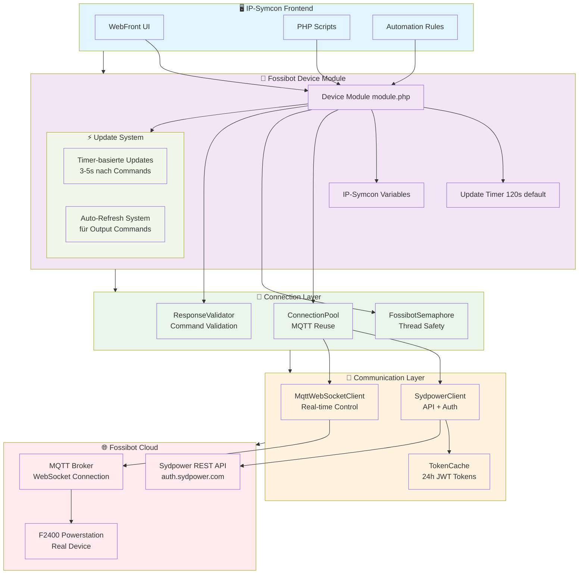
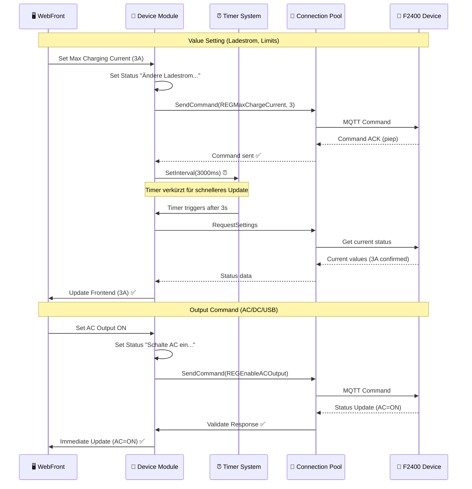
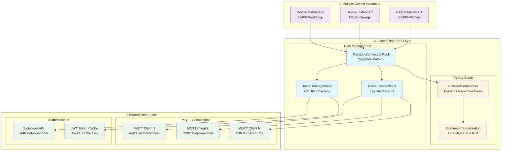
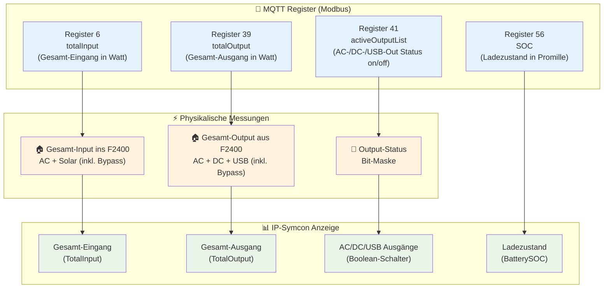

# Fossibot IP-Symcon Module

Ein **experimentelles** IP-Symcon Modul zur Überwachung und Steuerung von Fossibot Powerstations.

⚠️ **WICHTIGER HINWEIS**: Dieses Projekt basiert auf **Reverse Engineering** der Fossibot-API und ist **experimentell**. Es funktioniert bei mir mit einem F2400, aber es gibt keine Garantien. Die Entwicklung erfolgte durch Trial-and-Error ohne Kenntnis der Geräte-Interna.

## 🔋 Status & Kompatibilität

- **Fossibot F2400**: Funktioniert bei mir (ein Gerät getestet)
- **Fossibot F3600 Pro**: Ungetestet, könnte funktionieren

**Was das bedeutet:**
- Das Modul **scheint zu funktionieren**, ist aber nicht offiziell unterstützt
- Basiert auf **inoffizieller API-Nutzung** (Sydpower Cloud)
- **Deine Fossibot-App wird ausgeloggt** wenn das Modul läuft (nur eine Session pro Account)
- **Keine Garantie** dass es bei dir funktioniert

## 📋 Was funktioniert (bei mir)

### Monitoring ✅
- Batteriezustand (SOC) anzeigen
- Stromfluss Ein-/Ausgang anzeigen
- Output-Status (AC/DC/USB) anzeigen
- Automatische Updates alle 2 Minuten

### Steuerung ✅
- AC/DC/USB Ausgänge ein-/ausschalten
- Ladestrom einstellen (1-5A für F2400)
- Ladelimit einstellen (60-100%)
- Entladelimit einstellen (0-50%)

### Update-Verzögerungen (wichtig!)

**Realistische Erwartungen setzen:** Nach einem Klick im WebFront dauert es **10-15 Sekunden** dauern, bis sich die Anzeige aktualisiert. Ich habe noch keinen Weg gefunden, das weiter zu beschleunigen.

**Warum so langsam?**
- Gerät braucht Zeit zum Verarbeiten der Befehle
- MQTT-Updates kommen verzögert vom Cloud-Service
- Timer-System (s. unten) wartet bewusst einige Sekunden vor Status-Abfrage

**Geduld ist gefragt** - das Modul funktioniert, braucht aber Zeit. Für mich ist das akzeptabel, das ist ja kein Gerät in dem man wild herumklickt. 

### Was NICHT getestet ist ⚠️
- **Skript-Integration**: Die PHP-Funktionen existieren, aber ich habe sie nicht ausgiebig getestet
- **Mehrere Geräte**: Nur ein F2400 getestet
- **Langzeitstabilität**: Läuft erst seit August 2025 bei mir

## 🚀 Installation

### 1. Modul installieren

```bash
# In IP-Symcon Verwaltungskonsole
git clone https://github.com/tkaufmann/fossibot-ipsymcon /var/lib/symcon/modules/Fossibot
```

### 2. Discovery-Instanz erstellen

1. **Instanz hinzufügen** → **Fossibot Discovery**
2. **Fossibot-Account Daten** eingeben (E-Mail + Passwort)
3. **"Geräte suchen"** → Geräte-ID aus Log notieren

### 3. Device-Instanz erstellen

1. **Instanz hinzufügen** → **Fossibot F2400**
2. **Geräte-ID** eingeben
3. **Speichern**

## 🔧 Grundlegende Nutzung

### WebFront
- **Buttons**: AC/DC/USB Ein/Aus, Ladestrom 1-5A, Limits einstellen
- **Anzeigen**: SOC, Ein-/Ausgang in Watt, Verbindungsstatus
- **"Jetzt aktualisieren"**: Manueller Refresh

### Verhalten verstehen

Die Messwerte **"Gesamt-Eingang"** und **"Gesamt-Ausgang"** zeigen meiner Interpretation nach den kompletten Stromfluss durch das F2400-System an, nicht nur die batteriebezogenen Ströme. 

Bei Erreichen des Ladelimits beziehungsweise vollem Akku (100% SOC) schaltet das Gerät in den AC-Bypass-Modus - AC-Lasten laufen dann direkt vom Netz durch das F2400 zum Verbraucher, ohne die Batterie zu belasten. Diese Bypass-Ströme werden aber trotzdem in den MQTT-Messwerten erfasst, was anfangs verwirrend sein kann.


## 📊 Verfügbare Daten in IPSymcon

| Variable | Typ | Beschreibung | Einheit |
|----------|-----|--------------|---------|
| Ladezustand | Integer | Batterie-SOC | % |
| Gesamt-Eingang | Float | AC/Solar → F2400 System | W |
| Gesamt-Ausgang | Float | F2400 → AC/DC/USB | W |
| AC Ausgang | Boolean | AC-Ausgang Status | An/Aus |
| DC Ausgang | Boolean | DC-Ausgang Status | An/Aus |
| USB Ausgang | Boolean | USB-Ausgang Status | An/Aus |
| Ladelimit | Integer | Obere Ladegrenze | % |
| Entladelimit | Integer | Untere Entladegrenze | % |
| Max. Ladestrom | Integer | Maximaler Ladestrom | A |
| Letzte Aktualisierung | Integer | Timestamp | Unix-Zeit |
| Verbindungsstatus | String | Verbindungsinfo | Text |

## 🔧 Ladeleistung

Ich habe mir das Verhalten der F2400 beim Laden aus Handbuch und Beobachtungen zusammengereimt.

### Berechnung der Ladeleistung

Die Ladeleistung lässt sich näherungsweise so berechnen:

Watt = Volt × Ampere × Leistungsfaktor

Der Leistungsfaktor spiegelt dabei Ladeverluste wieder. Liegen diese bei 2 %, dann beträgt er 0,98. 

### Maximaler Ladestrom AC

Der F2400 bietet dafür zwei Einstellungen: 

- einen Drehregler am Gerät, der von 300 Watt bis 1.100 Watt reicht
- eine Einstellung in der App (beziehungsweise Webfront), die von 1 A (entspricht etwa 230 Watt) bis 15 A (3.450 Watt) reicht

Technisch ist der F2400 auf maximal 1.100 Watt limitiert. Deshalb sind Einstellungen oberhalb 5 A (entspricht 1.150 Watt) wahrscheinlich sinnlos. **Entsprechend habe ich die Skala im WebFront begrenzt.**

Der jeweils niedrigere der beiden Werte gilt. Steht der Drehregler auf 500 Watt, dann sind Einstellungen in der App/WebFront oberhalb von 2 A (460 Watt) wirkungslos. Naja, zumindest von den +40 Watt bei 3A abgesehen, aber es wird wohl verständlich. Bei meinem "AC only"-Setup habe ich den Drehregler fix auf 1.100 Watt stehen und steuere nur über WebFront. 

Ich gehe davon aus, dass die Einstellungen auch für das Aufladen im Auto gelten, aber unerheblich sind. Der F2400 lädt im Auto mit 12 V bei 10 A, was mageren 120 Watt entspricht und unter allen Limits liegt, die per Einstellungen vorgegeben werden können. 

### Maximaler Ladestrom DC

DC liefert maximal 500 Watt, abhängig von der Leistung der Solarpanels. Hierfür scheint es keine Einstellungen zu geben. 

### Anzeige Total Input/Output

- **totalInput/totalOutput** messen das **komplette F2400-System**
- **NICHT nur** Batterie-spezifische Ströme
- **AC-Bypass wird mit gemessen** und in MQTT-Werten angezeigt

**Beispiel bei 100% SOC + AC-Anschluss:**
```
Situation: 3D-Drucker 108W am AC-Ausgang, Batterie voll (100% SOC)
Gesamt-Eingang: 108W (AC-Input ins F2400-System)
Gesamt-Ausgang: 108W (AC-Output aus F2400-System)
AC-Ausgang: On        (Bypass-Modus bei vollem Akku)
```

**Bei Stromausfall:**
- **Umschaltung in <8ms** auf Batteriebetrieb
- **Gesamt-Ausgang** zeigt weiterhin die AC-Last (jetzt aus Batterie)
- **Gesamt-Eingang** wird 0W (kein Netz-Input mehr)


## 🎮 Skript-Integration ✅

✅ **Die PHP-Funktionen wurden erfolgreich implementiert und getestet:**

**Funktions-Signatur:** Alle FBT_* Funktionen verwenden die Instanz-ID als ersten Parameter, gefolgt von den eigentlichen Parametern.

**Status-Update Parameter:** Der letzte `$statusUpdate` Parameter (boolean) bestimmt, ob nach dem Befehl automatisch ein Status-Update ausgelöst wird:
- `true`: Sofortiges Status-Update (empfohlen für wichtige Änderungen)
- `false`: Kein automatisches Update (schneller, Update erfolgt beim nächsten Timer)

### Verfügbare Befehle

```php
// Instanz-ID deiner FossibotDevice-Instanz
$fossibotID = 12345; // Ersetze mit deiner echten ID

// === AUSGÄNGE STEUERN ===
FBT_SetACOutput($fossibotID, true, true);   // AC-Ausgang einschalten mit Status-Update
FBT_SetACOutput($fossibotID, false, false); // AC-Ausgang ausschalten ohne Status-Update

FBT_SetDCOutput($fossibotID, true, true);   // DC-Ausgang einschalten mit Status-Update  
FBT_SetDCOutput($fossibotID, false, true);  // DC-Ausgang ausschalten mit Status-Update

FBT_SetUSBOutput($fossibotID, true, true);  // USB-Ausgang einschalten mit Status-Update
FBT_SetUSBOutput($fossibotID, false, true); // USB-Ausgang ausschalten mit Status-Update

// === LADEPARAMETER (F2400: 1-5A) ===
FBT_SetMaxChargingCurrent($fossibotID, 3, true);   // Ladestrom: 3A (690W) mit Status-Update
FBT_SetMaxChargingCurrent($fossibotID, 5, true);   // Ladestrom: 5A (1150W) mit Status-Update

FBT_SetChargingLimit($fossibotID, 80, true);   // Ladelimit: 80% (60-100%) mit Status-Update
FBT_SetDischargeLimit($fossibotID, 20, true);  // Entladelimit: 20% (0-50%) mit Status-Update

// === STATUS & UPDATES ===
FBT_UpdateDeviceStatus($fossibotID);           // Status manuell aktualisieren
FBT_RequestSettings($fossibotID);              // Einstellungen anfordern

// === UTILITY FUNCTIONS ===
$deviceInfo = FBT_GetDeviceInfo($fossibotID);      // Device-Info als String abrufen
FBT_ClearDeviceCache($fossibotID);                 // Device-Cache leeren  
FBT_ClearTokenCache($fossibotID);                  // Token-Cache leeren
```

### Praktische Beispiele

✅ **Diese Beispiele verwenden die korrekte, getestete Signatur:**

```php
// Zeitgesteuertes Laden
FBT_SetMaxChargingCurrent($fossibotID, 1, true);  // Nachts: Eco-Modus mit Update
FBT_SetMaxChargingCurrent($fossibotID, 3, true);  // Tags: Normal-Modus mit Update

// Batterie-Level basierte Steuerung
$soc = GetValue(IPS_GetObjectIDByIdent('BatterySOC', $fossibotID));
if ($soc < 20) {
    FBT_SetMaxChargingCurrent($fossibotID, 5, true);  // Notladung mit Update
}

// Nacht-Modus: Alle Ausgänge aus, minimales Laden
FBT_SetACOutput($fossibotID, false, false);        // AC aus (ohne Update)
FBT_SetDCOutput($fossibotID, true, false);         // DC an für Router (ohne Update)  
FBT_SetUSBOutput($fossibotID, false, false);       // USB aus (ohne Update)
FBT_SetMaxChargingCurrent($fossibotID, 1, true);   // Eco-Laden (mit Update)

// Stromausfall-Reaktion: Alles an, maximales Laden  
FBT_SetACOutput($fossibotID, true, false);         // AC sofort an
FBT_SetDCOutput($fossibotID, true, false);         // DC sofort an
FBT_SetUSBOutput($fossibotID, true, false);        // USB sofort an
FBT_SetMaxChargingCurrent($fossibotID, 5, true);   // Max-Ladung (mit finalem Update)
```

### Debugging & Wartung

```php
// Verbindungsprobleme beheben
FBT_ClearTokenCache($fossibotID);       // Token-Cache leeren
FBT_ClearDeviceCache($fossibotID);      // Device-Cache leeren
FBT_UpdateDeviceStatus($fossibotID);    // Status neu laden

// Device-Informationen abrufen
$info = FBT_GetDeviceInfo($fossibotID);
echo "Device Info: " . $info;
```

## 🐛 Bekannte Probleme

### App-Logout Problem
- **Problem**: Fossibot Mobile App wird ausgeloggt wenn IP-Symcon Updates abruft
- **Ursache**: Nur eine aktive Session pro Account erlaubt
- **Lösung**: Mobile App weniger nutzen während IP-Symcon aktiv ist

### Experimentelle Natur
- **Nicht alle Edge-Cases getestet**
- **Basiert auf Reverse Engineering**
- **Keine offizieller Support von Fossibot**
- **API könnte sich jederzeit ändern**

### Update-Verzögerungen
- Nach Befehlen dauert es **10-15 Sekunden** bis Frontend aktualisiert wird
- Das ist normal - ich habe noch keinen Weg gefunden, das zu beschleunigen

## 🧪 Für Entwickler

### Wie es funktioniert (technisch)



### Update-System für Anzeige im WebFront

Das Update-System nutzt zwei verschiedene Strategien je nach Command-Typ - das ist das Ergebnis vieler Trial-and-Error Versuche:

- **Timer-basiert** (Limits, Ladestrom): Befehl senden → Zeit bis zum nächsten Timer-basierten Update einmalig auf 3-5s verkürzen → reguläres Timer-Update aktualisiert Status
- **Sofort-Validierung** (Outputs): Befehl senden → Response validieren → Frontend sofort updaten

**Warum verschiedene Strategien?** Nach meinen Experimenten verhalten sich Output-Befehle (AC/DC/USB ein/aus) anders als Wert-Einstellungen (Ladestrom, Limits). Output-Befehle liefern sofort eine Bestätigung mit dem neuen Status zurück, während Wert-Einstellungen nur ein "Command empfangen" senden, aber die neuen Werte erst später über separate Status-Updates verfügbar werden.



### Connection Pool Architecture

Das Connection-Pool-System reduziert API-Aufrufe und verbessert die Performance:



#### MQTT-Register-Mapping



**Wichtige MQTT-Register:**
- **Register 6** (totalInput) = Gesamt-Eingang ins F2400-System [W]
- **Register 39** (totalOutput) = Gesamt-Ausgang aus F2400-System [W]  
- **Register 56** (SOC) = Ladezustand [Promille → %]
- **Register 41** (activeOutputList) = Output-Status [Bit-Maske]

**Bit-Zuordnung Register 41:**
```
Bit 9  = USB-Ausgang
Bit 10 = DC-Ausgang  
Bit 11 = AC-Ausgang
```

### Architektur
- **Discovery-Modul** (Typ 4): Zentrale Anmeldung und Geräteerkennung
- **Device-Modul** (Typ 3): Individual Geräte-Monitoring
- **Connection Pool Layer**: MQTT-Verbindungen wiederverwenden
- **Update System**: Timer + Auto-Refresh Hybrid
- **Response Validation**: Command-Validierung

### Kommunikation
- **HTTPS API**: Authentifizierung und Geräteabfrage
- **MQTT over WebSocket**: Echtzeit-Statusupdates
- **JWT Tokens**: 24-Stunden gültige Zugriffstoken
- **Modbus Protocol**: Gerätesteuerung über MQTT
- **Connection Pooling**: Wiederverwendung von MQTT-Clients

### Debugging
- Logs in IP-Symcon Meldungen anschauen
- ConnectionStatus Variable zeigt aktuellen Zustand
- Debug-Level in den Einstellungen erhöhen

## Support

- **GitHub Issues**: https://github.com/tkaufmann/fossibot-ipsymcon/issues
- **IP-Symcon Community**: https://community.symcon.de

**Bei Bug Reports bitte angeben:**
- Gerätemodell und Firmware-Version
- IP-Symcon Version  
- Debug-Logs aus den Meldungen
- Schritte zur Reproduktion

## Contributing

**Neue Geräte testen:**
- Teste das Modul mit deinem Gerät
- Dokumentiere was funktioniert/nicht funktioniert
- Erstelle Issues mit Debug-Logs

**Code-Verbesserungen:**
- Pull Requests willkommen
- Bitte erst Issues für größere Änderungen erstellen

## License

MIT License

## Credits

- **Fossibot-Code von iamslan**: [Reverse Engineering](https://github.com/iamslan/fossibot-reverse-engineering) und [HA-Integration](https://github.com/iamslan/fossibot)

---

⚠️ **Disclaimer**: Experimentelles Projekt ohne Garantien. Nutze es auf eigenes Risiko.