# Fossibot IP-Symcon Module

Ein IP-Symcon Modul zur Überwachung und Steuerung von Fossibot Powerstations über die Sydpower API.

## 🔋 Unterstützte Geräte

- **Fossibot F2400** ✅ **Vollständig getestet und funktional**
- **Fossibot F3600 Pro** ⚠️ **Nicht getestet** - sollte theoretisch funktionieren

## 📋 Features

⚠️ **Wichtiger Hinweis**: Die Nutzung dieses Moduls kann dazu führen, dass du aus der Fossibot Mobile App ausgeloggt wirst, da nur eine aktive Session pro Account erlaubt ist.

### Monitoring
- **Echtzeit-Daten** alle 2 Minuten automatisch aktualisiert
- **Batteriezustand** (SOC) in Prozent
- **Batterie-Eingang** (Solar/AC → Batterie)
- **Batterie-Ausgang** (Batterie → DC/USB/Inverter)
- **Output-Status** (AC/DC/USB Ausgänge An/Aus)
- **Ladelimits** (Obere/Untere Grenzwerte)
- **Ladestrom-Einstellungen**
- **Verbindungsstatus** und letzte Aktualisierung

### Konfiguration  
- **Zentrale Anmeldedaten** - Nur einmal in der Discovery-Instanz eingeben
- **Automatische Geräteerkennung** - "Geräte suchen" Button
- **Einfache Gerätekonfiguration** - Nur Geräte-ID erforderlich
- **Flexible Update-Intervalle** - Von 60 Sekunden bis 1 Stunde

### Steuerung
- **AC/DC/USB Ausgänge** - Ein-/Ausschalten über Buttons oder Skripte
- **Ladestrom-Steuerung** - 1A bis 5A in 1A-Schritten (optimiert für F2400)
- **Ladelimit-Steuerung** - 60-100% in 5%-Schritten (9 Buttons)
- **Entladelimit-Steuerung** - 0-50% in 5%-Schritten (11 Buttons)
- **Erweiterte Funktionen** - Einstellungen anfordern und Status aktualisieren

### Integration
- **Vollständige IP-Symcon Integration** - Native Variablen und Profile
- **Smart Home Automatisierung** - Basierend auf Batterielevel, Verbrauch etc.
- **Webfront-kompatibel** - Übersichtliche Anzeige aller Werte
- **Event-driven** - Trigger für Automatisierungen verfügbar
- **Skript-Integration** - Alle Funktionen direkt in PHP-Skripten nutzbar

## 🚀 Installation

### 1. Modulbibliothek hinzufügen

1. **IP-Symcon Verwaltungskonsole** öffnen
2. **Bibliothek hinzufügen** → `https://github.com/tkaufmann/fossibot-ipsymcon`
3. **Oder per Git**: `git clone https://github.com/tkaufmann/fossibot-ipsymcon /var/lib/symcon/modules/Fossibot`
4. **Oder manuell**: Module nach `/var/lib/symcon/modules/Fossibot/` kopieren

### 2. Discovery-Instanz erstellen

1. **Instanz hinzufügen** → **Konfigurator** (Fossibot Discovery)
2. **E-Mail und Passwort** deines Fossibot-Accounts eingeben
3. **"Geräte suchen"** klicken
4. Notiere dir die **Geräte-ID** aus dem Log

### 3. Device-Instanz erstellen

1. **Instanz hinzufügen** → **Fossibot F2400** (oder F3600/Generic)
2. **Geräte-ID** eingeben (z.B. `7C2C67AB5F0E`)
3. **Update-Intervall** nach Bedarf anpassen (Standard: 120 Sekunden)
4. **Speichern** - Zugangsdaten werden automatisch übernommen

## 📊 Variablen-Übersicht

| Variable | Typ | Beschreibung | Einheit |
|----------|-----|--------------|---------|
| Ladezustand | Integer | Batterie-SOC | % |
| Batterie-Eingang | Float | Solar/AC → Batterie | W |
| Batterie-Ausgang | Float | Batterie → DC/USB/Inverter | W |
| AC Ausgang | Boolean | AC-Ausgang Status | An/Aus |
| DC Ausgang | Boolean | DC-Ausgang Status | An/Aus |
| USB Ausgang | Boolean | USB-Ausgang Status | An/Aus |
| Ladelimit | Integer | Obere Ladegrenze | % |
| Entladelimit | Integer | Untere Entladegrenze | % |
| Max. Ladestrom | Integer | Maximaler Ladestrom | A |
| Letzte Aktualisierung | Integer | Timestamp | Unix-Zeit |
| Verbindungsstatus | String | Verbindungsinfo | Text |

## 🔧 Konfiguration

### Update-Intervall
- **Standard**: 120 Sekunden (2 Minuten) - Empfohlener Wert
- **Minimum**: 60 Sekunden (nur für Tests)
- **Empfohlen**: 120-300 Sekunden (Normalbetrieb)
- **Maximum**: 3600 Sekunden (1 Stunde)

⚠️ **Wichtiger Hinweis**: Häufige API-Aufrufe können dazu führen, dass du aus der Fossibot Mobile App ausgeloggt wirst, da nur eine aktive Session pro Account erlaubt ist.

### Ladestrom-Konfiguration (F2400)

**Warum nur 1-5A statt 1-20A?**
- Das **F2400 kann maximal 1100W AC** aufnehmen
- **5A × 230V = 1150W** entspricht bereits dem Maximum
- Werte über 5A bringen **keine höhere Ladeleistung**
- Die Skala wurde **optimiert für echte F2400-Nutzung**

**Praktische Werte:**
- **1A** = 230W (Schonladung, schwache Sicherungen)
- **2A** = 460W (Langsame Ladung)
- **3A** = 690W (Normale Ladung)
- **4A** = 920W (Schnelle Ladung)
- **5A** = 1150W (Maximum für F2400)

### Drehregler am F2400

**Empfohlene Einstellung:**
- **Drehregler auf Maximum** (1100W) stellen
- **Steuerung komplett über IP-Symcon** (1-5A)
- **Vorteil**: Fernsteuerung und Automatisierung möglich

**Kombinierte AC + Solar Ladung:**
- **AC**: bis 1100W (gesteuert über IP-Symcon 1-5A)
- **Solar**: bis 500W (automatisch, je nach Verfügbarkeit)
- **Gesamt**: bis **1600W kombiniert** bei Sonnenschein
- **Ladezeit**: ca. 1,5h von 0% auf 80% bei vollem AC+Solar

### UPS-Bypass-Verhalten (F2400)

**Wichtiges Verhalten bei AC-Anschluss:**
- **AC-Lasten** werden **direkt** vom Netz versorgt (Bypass)
- **Batterie-Eingang** zeigt nur Strom **zur Batterie**
- **Batterie-Ausgang** zeigt nur Strom **aus der Batterie** (DC/USB/Inverter bei Stromausfall)
- **AC-Bypass-Strom erscheint NICHT** in den Messwerten

**Beispiel bei angeschlossenem AC:**
```
Situation: 3D-Drucker 15W am AC-Ausgang, Batterie lädt mit 300W
Batterie-Eingang: 300W (Netzstrom → Batterie)
Batterie-Ausgang: 0W   (AC-Last läuft über Bypass)
AC-Ausgang: On         (Bypass aktiv)
```

**Bei Stromausfall:**
- **Umschaltung in <8ms** auf Batteriebetrieb
- **Batterie-Ausgang** zeigt dann die AC-Last
- **Batterie-Eingang** wird 0W

## 🔌 Stromfluss-Diagramme (F2400)

### Normal-Betrieb mit AC-Anschluss (UPS-Bypass)

**Beispiel-Szenario:** 3D-Drucker am AC-Ausgang (100W), Drehregler auf 300W

```mermaid
flowchart LR
    AC[⚡ Netz 230V] -->|400W gesamt| F2400[🏠 F2400 Powerstation]
    
    F2400 -->|100W Bypass| ACOut[🔌 AC-Ausgang 3D-Drucker 100W]
    F2400 -->|300W| Battery[🔋 Batterie 2048Wh]
    
    Battery -.->|0W aus| DCOut[🔌 DC-Ausgang]
    Battery -.->|0W aus| USBOut[🔌 USB-Ausgang]
    
    %% MQTT Messwerte
    F2400 -.->|totalInput=300W| MQTT1[📊 Batterie-Eingang]
    Battery -.->|totalOutput=0W| MQTT2[📊 Batterie-Ausgang]
    
    %% Styling
    classDef power fill:#e1f5fe
    classDef device fill:#f3e5f5
    classDef mqtt fill:#e8f5e8
    classDef off fill:#ffebee,stroke-dasharray: 5 5
    
    class AC power
    class F2400,ACOut,DCOut,USBOut,Battery device
    class MQTT1,MQTT2 mqtt
    class DCOut,USBOut off
```



**Wichtige Erkenntnisse:**
- 🏠 **F2400 verteilt**: 100W Bypass + 300W zur Batterie (Drehregler-begrenzt)
- 🔄 **AC-Bypass**: Läuft direkt vom Netz, nicht durch die Batterie
- 📊 **Batterie-Eingang**: 300W = Was zur Batterie fließt (MQTT totalInput)
- 📊 **Batterie-Ausgang**: 0W = DC/USB aus (MQTT totalOutput)
- ⚠️ **Bypass unsichtbar**: AC-Bypass-Verbrauch erscheint nicht in MQTT

### Solar-Betrieb ohne Netz

```mermaid
flowchart LR
    Solar[☀️ Solar 400W] -->|400W| F2400[🏠 F2400 Powerstation]
    
    F2400 -->|380W| Battery[🔋 Batterie 2048Wh]
    F2400 -->|180W via Inverter| ACOut[🔌 AC-Ausgang 180W]
    F2400 -->|50W| DCOut[🔌 DC-Ausgang 50W]
    F2400 -->|20W| USBOut[🔌 USB-Ausgang 20W]
    
    %% MQTT Messwerte
    F2400 -.->|totalInput=380W| MQTT1[📊 Batterie-Eingang]
    F2400 -.->|totalOutput=250W| MQTT2[📊 Batterie-Ausgang]
    
    %% Styling
    classDef power fill:#fff3e0
    classDef device fill:#f3e5f5
    classDef mqtt fill:#e8f5e8
    
    class Solar power
    class F2400,ACOut,DCOut,USBOut,Battery device
    class MQTT1,MQTT2 mqtt
```



**Wichtige Erkenntnisse:**
- 🏠 **F2400 ohne Netz**: Alle Ausgänge laufen aus der Batterie (kein Bypass)
- ⚙️ **MPPT-Verluste**: 400W Solar → 380W nutzbar (5% Verlust)
- 📊 **Batterie-Eingang**: 380W Solar-Input (MQTT totalInput)
- 📊 **Batterie-Ausgang**: 250W = AC+DC+USB kombiniert (MQTT totalOutput)
- 🔋 **Netto-Ladung**: +130W (380W rein, 250W raus)

### Stromausfall-Umschaltung (<8ms)

```mermaid
sequenceDiagram
    participant Netz as ⚡ Netz
    participant Bypass as 🔄 AC-Bypass
    participant Battery as 🔋 Batterie
    participant Inverter as 🔄 Inverter
    participant Load as 🔌 AC-Last
    participant MQTT as 📊 MQTT-Werte
    
    Note over Netz,MQTT: Normal-Betrieb (UPS-Bypass)
    Netz->>Bypass: 15W direkter Durchfluss
    Bypass->>Load: 15W (3D-Drucker)
    Netz->>Battery: 300W Ladestrom
    MQTT->>MQTT: Batterie-Eingang=300W<br/>Batterie-Ausgang=0W
    
    Note over Netz,MQTT: ⚡ STROMAUSFALL ⚡
    Netz--xBypass: ❌ Kein Strom
    Note over Bypass,Inverter: Umschaltung <8ms
    Battery->>Inverter: 15W für AC-Last
    Inverter->>Load: 15W (3D-Drucker)
    MQTT->>MQTT: Batterie-Eingang=0W<br/>Batterie-Ausgang=15W
    
    Note over Netz,MQTT: 🔌 STROM ZURÜCK 🔌
    Netz->>Bypass: 15W direkter Durchfluss
    Note over Bypass,Inverter: Rückschaltung <8ms
    Bypass->>Load: 15W (3D-Drucker)
    Battery--xInverter: ❌ Kein Bedarf
    MQTT->>MQTT: Batterie-Eingang=300W<br/>Batterie-Ausgang=0W
```



### MQTT-Register-Mapping

Meine Interpretation:

```mermaid
graph TB
    subgraph "📡 MQTT Register (Modbus)"
        R6["Register 6<br/>totalInput<br/>(Batterie-Eingang)"]
        R39["Register 39<br/>totalOutput<br/>(Batterie-Ausgang)"]
        R56["Register 56<br/>SOC<br/>(Ladezustand)"]
        R41["Register 41<br/>activeOutputList<br/>(AC/DC/USB Status)"]
    end
    
    subgraph "⚡ Physikalische Messungen"
        BattIn["🔋 Strom zur Batterie<br/>Solar + AC-Überschuss"]
        BattOut["🔋 Strom aus Batterie<br/>DC + USB + Inverter"]
        Outputs["🔌 Output-Status<br/>Bit-Maske"]
    end
    
    subgraph "📊 IP-Symcon Anzeige"
        IPSIn["Batterie-Eingang<br/>(TotalInput)"]
        IPSOut["Batterie-Ausgang<br/>(TotalOutput)"]
        IPSSOC["Ladezustand<br/>(BatterySOC)"]
        IPSOutputs["AC/DC/USB Ausgänge<br/>(Boolean-Schalter)"]
    end
    
    R6 --> BattIn --> IPSIn
    R39 --> BattOut --> IPSOut
    R56 --> IPSSOC
    R41 --> Outputs --> IPSOutputs
    
    %% Styling
    classDef mqtt fill:#e3f2fd
    classDef physical fill:#fff3e0
    classDef ips fill:#e8f5e8
    
    class R6,R39,R56,R41 mqtt
    class BattIn,BattOut,Outputs physical
    class IPSIn,IPSOut,IPSSOC,IPSOutputs ips
```



**Wichtige MQTT-Register:**
- **Register 6** (totalInput) = Batterie-Eingang [W]
- **Register 39** (totalOutput) = Batterie-Ausgang [W]  
- **Register 56** (SOC) = Ladezustand [Promille → %]
- **Register 41** (activeOutputList) = Output-Status [Bit-Maske]

**Bit-Zuordnung Register 41:**
```
Bit 9  = USB-Ausgang
Bit 10 = DC-Ausgang  
Bit 11 = AC-Ausgang
```

### Steuerung über Buttons
- **AC/DC/USB Ein/Aus** - Direkte Ausgänge-Steuerung
- **Ladestrom** - 1A, 2A, 3A, 4A, 5A Buttons (angepasst für F2400)
- **Ladelimit** - 60%, 65%, 70%, 75%, 80%, 85%, 90%, 95%, 100% Buttons
- **Entladelimit** - 0%, 5%, 10%, 15%, 20%, 25%, 30%, 35%, 40%, 45%, 50% Buttons
- **"Jetzt aktualisieren"** - Sofortige Datenabfrage
- **"Geräteinformationen"** - Debug-Informationen
- **"Einstellungen anfordern"** - Aktuelle Geräteeinstellungen abrufen

## 🔐 Sicherheit

- **Zugangsdaten verschlüsselt** in IP-Symcon Properties gespeichert
- **Token-Caching** - Minimiert API-Aufrufe (24h Gültigkeit)
- **Sichere MQTT-Verbindung** über WebSocket
- **Automatische Token-Erneuerung** bei Ablauf

## 🧪 Technische Details

### Architektur
- **Discovery-Modul** (Typ 4): Zentrale Anmeldung und Geräteerkennung
- **Device-Modul** (Typ 3): Individual Geräte-Monitoring
- **Fossibot-PHP Library**: API-Client für Sydpower-Backend
- **Token-Cache**: Optimierte Authentifizierung

### Kommunikation
- **HTTPS API**: Authentifizierung und Geräteabfrage
- **MQTT over WebSocket**: Echtzeit-Statusupdates
- **JWT Tokens**: 24-Stunden gültige Zugriffstoken
- **Modbus Protocol**: Gerätesteuerung über MQTT

### Debugging
- **Umfassendes Logging** auf verschiedenen Log-Leveln
- **Token-Debug-Info** zur Troubleshooting
- **Verbindungsstatus-Tracking**
- **MQTT-Message-Debugging**

## 🐛 Bekannte Probleme & Lösungen

### Token-Invalidierung / App-Logout
- **Ursache**: Fossibot Mobile App und IP-Symcon teilen sich einen Account - nur eine aktive Session möglich
- **Symptom**: Wirst aus der Mobile App ausgeloggt, wenn IP-Symcon Updates abruft
- **Lösung**: 
  - **Mobile App weniger nutzen** während IP-Symcon aktiv ist

## 🎮 Steuerung über Skripte

Alle Funktionen können direkt in IP-Symcon PHP-Skripten verwendet werden:

### Verfügbare Befehle

```php
// Instanz-ID deiner FossibotDevice-Instanz
$fossibotID = 12345; // Ersetze mit deiner echten ID

// === AUSGÄNGE STEUERN ===
FBT_SetACOutput($fossibotID, true);   // AC-Ausgang einschalten
FBT_SetACOutput($fossibotID, false);  // AC-Ausgang ausschalten

FBT_SetDCOutput($fossibotID, true);   // DC-Ausgang einschalten  
FBT_SetDCOutput($fossibotID, false);  // DC-Ausgang ausschalten

FBT_SetUSBOutput($fossibotID, true);  // USB-Ausgang einschalten
FBT_SetUSBOutput($fossibotID, false); // USB-Ausgang ausschalten

// === LADEPARAMETER (F2400: 1-5A) ===
FBT_SetMaxChargingCurrent($fossibotID, 1);   // Ladestrom: 1A (230W - minimal)
FBT_SetMaxChargingCurrent($fossibotID, 2);   // Ladestrom: 2A (460W - langsam)
FBT_SetMaxChargingCurrent($fossibotID, 3);   // Ladestrom: 3A (690W - normal)
FBT_SetMaxChargingCurrent($fossibotID, 4);   // Ladestrom: 4A (920W - schnell)
FBT_SetMaxChargingCurrent($fossibotID, 5);   // Ladestrom: 5A (1150W - maximum für F2400)

FBT_SetChargingLimit($fossibotID, 80);   // Ladelimit: 80% (60-100%)
FBT_SetChargingLimit($fossibotID, 90);   // Ladelimit: 90%
FBT_SetChargingLimit($fossibotID, 100);  // Ladelimit: 100%

FBT_SetDischargeLimit($fossibotID, 0);   // Entladelimit: 0% (0-50%)
FBT_SetDischargeLimit($fossibotID, 20);  // Entladelimit: 20%
FBT_SetDischargeLimit($fossibotID, 30);  // Entladelimit: 30%

FBT_SetChargeTimer($fossibotID, 60);     // Lade-Timer: 60 Minuten

// === STATUS & UPDATES ===
FBT_UpdateDeviceStatus($fossibotID);     // Status manuell aktualisieren
FBT_RequestSettings($fossibotID);        // Einstellungen anfordern
FBT_SetUpdateInterval($fossibotID, 300); // Update-Intervall: 5 Minuten
FBT_RefreshNow($fossibotID);             // Sofort aktualisieren
FBT_GetDeviceInfo($fossibotID);          // Geräteinformationen
```

### Praktische Beispiele

**Zeitgesteuertes Laden (Ablaufplan):**
```php
// Nachts: Eco-Modus (minimales Laden)
FBT_SetMaxChargingCurrent($fossibotID, 1);
FBT_SetChargingLimit($fossibotID, 80);

// Tags: Normal-Modus
FBT_SetMaxChargingCurrent($fossibotID, 10);
FBT_SetChargingLimit($fossibotID, 100);
```

**Solar-Überschuss-Steuerung:**
```php
// Bei hoher PV-Leistung: Vollgas laden (F2400)
$pvPower = GetValue($pvInstanceID);
if ($pvPower > 1000) {
    FBT_SetMaxChargingCurrent($fossibotID, 5);  // Maximum für F2400
    FBT_SetChargingLimit($fossibotID, 100);
} elseif ($pvPower > 500) {
    FBT_SetMaxChargingCurrent($fossibotID, 3);  // Moderate Ladung
} else {
    FBT_SetMaxChargingCurrent($fossibotID, 1);  // Eco-Modus
}
```

**Batterie-Level Management:**
```php
// Aktuellen SOC prüfen
$soc = GetValue(IPS_GetObjectIDByIdent('BatterySOC', $fossibotID));

if ($soc < 20) {
    // Notladung aktivieren (F2400)
    FBT_SetMaxChargingCurrent($fossibotID, 5);  // Maximum für F2400
    FBT_SetChargingLimit($fossibotID, 100);
} elseif ($soc > 95) {
    // Erhaltungsladung
    FBT_SetMaxChargingCurrent($fossibotID, 1);
}
```

**Strompreis-Optimierung:**
```php
// Bei niedrigen Strompreisen (z.B. nachts) - F2400
if ($strompreis < 0.20) {
    FBT_SetMaxChargingCurrent($fossibotID, 5);  // Maximum für F2400
} else {
    FBT_SetMaxChargingCurrent($fossibotID, 1);  // Eco-Modus
}
```

**Geräte basierend auf Batterielevel steuern:**
```php
$soc = GetValue(IPS_GetObjectIDByIdent('BatterySOC', $fossibotID));

if ($soc < 30) {
    // Stromsparmodus: Nur AC für wichtige Geräte
    FBT_SetUSBOutput($fossibotID, false);
    FBT_SetDCOutput($fossibotID, false);
} else {
    // Normalmodus: Alle Ausgänge an
    FBT_SetUSBOutput($fossibotID, true);
    FBT_SetDCOutput($fossibotID, true);
}
```

### Instanz-ID ermitteln

```php
// Per Objektbaum: Rechtsklick auf FossibotDevice → Eigenschaften → ID

// Oder automatisch suchen:
$instances = IPS_GetInstanceListByModuleID('{DEINE-FOSSIBOT-MODUL-GUID}');
$fossibotID = $instances[0]; // Erste gefundene Instanz
```

## 🔄 Changelog

### v1.7 - Aktuell
- ✅ **Präzise Batterie-Labels** - "Batterie-Eingang/Ausgang" statt "Gesamt"
- ✅ **UPS-Bypass-Verhalten dokumentiert** - AC-Lasten erscheinen nicht in Messwerten
- ✅ **Technisch korrekte Interpretation** - Werte zeigen echten Batterie-Durchsatz

### v1.6
- ✅ **F2400-optimierte Ladestrom-Skala** - 1-5A statt 1-20A (da F2400 max 1100W AC)
- ✅ **Vollständige Webfront-Steuerung** - Slider für Limits, Dropdown für Ladestrom
- ✅ **Kombinierte AC+Solar Dokumentation** - bis 1600W Gesamtladeleistung
- ✅ **Drehregler-Empfehlungen** - Optimale Konfiguration für IP-Symcon Steuerung
- ✅ **Stille MQTT-Kommunikation** - Keine störenden Debug-Meldungen mehr

### v1.5
- ✅ **Entladelimit 0% freigegeben** - Vollständige Kontrolle 0-50%
- ✅ **11 Entladelimit-Buttons** - 0%, 5%, 10%, 15%, 20%, 25%, 30%, 35%, 40%, 45%, 50%
- ✅ **Erweiterte Entlade-Kontrolle** - Komplette Bandbreite verfügbar

### v1.4
- ✅ **App-konforme Limits** - Ladelimit 60-100%, Entladelimit 5-50%
- ✅ **Erweiterte Button-Arrays** - 9 Ladelimit + 10 Entladelimit Buttons
- ✅ **Validierung angepasst** - Sichere Bereiche wie in Fossibot App
- ✅ **Vollständige Batterie-Kontrolle** - Lade- und Entladeparameter

### v1.3
- ✅ **Entladelimit-Steuerung** - Neue FBT_SetDischargeLimit() Funktion  
- ✅ **REGDischargeLowerLimit** - Modbus-Befehl implementiert
- ✅ **Erweiterte Ladelimits** - 50-100% in 5%-Schritten

### v1.2
- ✅ **Vollständige Steuerung** - AC/DC/USB Ausgänge schaltbar
- ✅ **Ladeparameter-Steuerung** - Ladestrom (1-20A) und Ladelimit (80-100%)
- ✅ **Skript-Integration** - Alle Funktionen in PHP-Skripten nutzbar
- ✅ **Optimiertes Button-Layout** - Übersichtliche Reihen-Anordnung
- ✅ **Reduziertes Logging** - Weniger Spam, nur relevante Meldungen

### v1.1
- ✅ **Korrekte Output-Bit-Zuordnung** für F2400
- ✅ **Automatische Timer-Updates** funktional
- ✅ **Verbesserte Token-Wiederverwendung**
- ✅ **Zentrale Zugangsdaten-Verwaltung**
- ✅ **Umfassendes Debug-System**

### v1.0 - Initial Release  
- ⚠️ Falsche AC/DC/USB Bit-Assignments
- ⚠️ Timer-Updates nicht funktional

## 🤝 Contributing

### Neue Geräte testen
Falls du einen **F3600 Pro** oder andere Fossibot-Geräte hast:

1. **Teste das Modul** und dokumentiere die Ergebnisse
2. **Bit-Pattern analysieren** falls Output-Status falsch
3. **Issues erstellen** auf GitHub mit Debug-Logs
4. **Pull Requests** für Verbesserungen willkommen

### Bug Reports
- **Debug-Logs** aus IP-Symcon Meldungen anhängen
- **Gerätemodell** und Firmware-Version angeben
- **Schritte zur Reproduktion** beschreiben

## 📞 Support

- **GitHub Issues**: https://github.com/tkaufmann/fossibot-ipsymcon/issues
- **IP-Symcon Community**: https://community.symcon.de
- **Fossibot-PHP Library**: https://github.com/tkaufmann/fossibot-php

## 📜 License

MIT License - Siehe LICENSE Datei für Details.

## 🙏 Credits

- **Fossibot-PHP Library**: Basis-API-Client für Sydpower
- **IP-Symcon Community**: Unterstützung und Testing
- **Reverse Engineering**: Sydpower API Protokoll-Analyse

---

⚡ **Powered by Fossibot F2400** - Getestet mit echten Geräten für maximale Zuverlässigkeit!